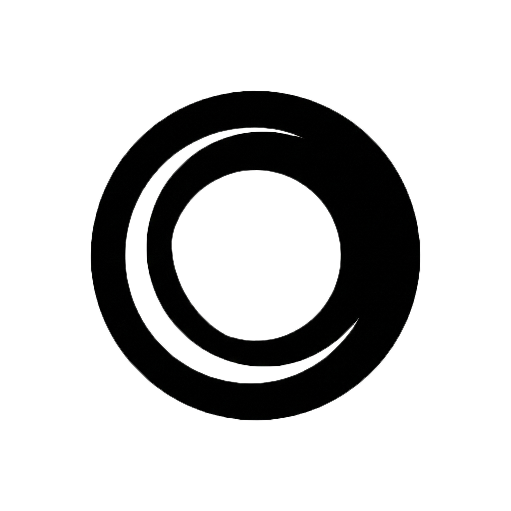

<p align="center">
  
</p>

<h1 align="center">OasisScreen</h1>

<p align="center">
  Лёгкий и быстрый инструмент для создания скриншотов на Windows с встроенным редактором аннотаций.
</p>

<p align="center">
  
  
  
</p>

---

## ✨ Возможности

| Функция | Описание |
|---------|----------|
| 📸 **Снимок с выделением** | Выделите мышью нужную область экрана |
| ⚡ **Моментальный снимок** | Мгновенный скриншот всего экрана одной горячей клавишей |
| ✏️ **Карандаш** | Свободное рисование поверх скриншота |
| ➡️ **Стрелка** | Стрелки для указания на элементы |
| 🔤 **Текст** | Добавление текстовых подписей |
| 🟥 **Мозаика** | Размытие чувствительной информации |
| ⭐ **Фигуры** | Прямоугольник, круг, подчёркивание |
| 🔍 **Лупа** | Круговое увеличение области — как на скриншотах iPhone |
| 🎨 **Выбор цвета** | Любой цвет для всех инструментов рисования |
| ↩️ **Отмена / Возврат** | `Ctrl+Z` / `Ctrl+Y` — до 30 шагов истории |
| 📂 **Папка сохранения** | Настраиваемый путь (по умолчанию: `Изображения\Снимки экрана`) |
| 📋 **Буфер обмена** | Автоматическое копирование после сохранения |
| 🚀 **Автозагрузка** | Запуск вместе с Windows |
| 🎯 **Системный трей** | Приложение работает в фоне, не мешая |

---

## ⌨️ Горячие клавиши

| Комбинация | Действие |
|------------|----------|
| `Ctrl + Shift + S` | Снимок с выделением области (по умолчанию) |
| `Ctrl + Alt + S` | Моментальный снимок всего экрана (по умолчанию) |
| `Ctrl + Z` | Отменить последнее действие (в редакторе) |
| `Ctrl + Y` | Вернуть отменённое действие (в редакторе) |
| `Esc` | Закрыть редактор скриншота |

> Горячие клавиши для снимков настраиваются в окне **Настройки**.

---

## 🖥️ Панель инструментов редактора

После выделения области экрана появляется компактная панель инструментов:

```
[ ✖ ][ ⭐ ][ 🟥 ][ ✏️ ][ ➡️ ][ 🔤 ][ 🎨 ][ 🔍 ][ 💾 ]
 Закр Фигур Мозаи Каран Стрел Текст Цвет  Лупа  Сохр
```

- **Лупа (🔍)** — нажмите в центр интересующей области, потяните мышь для задания радиуса увеличения. Создаёт круговую зону с 2x увеличением, обрамлённую рамкой — аналог функции увеличения из скриншотов Apple iPhone.

---

## ⚙️ Настройки

Доступ: **правый клик по иконке в трее → Настройки**

- 🔑 Горячая клавиша для снимка с выделением
- 🔑 Горячая клавиша для моментального снимка
- 🎨 Цвет рамки выделения
- 📂 Папка сохранения снимков
- 📋 Копировать в буфер обмена после сохранения
- 🚀 Запускать при старте Windows

Все настройки сохраняются в реестре Windows (`HKCU\Software\ScreenCaptureApp`).

---

## 🛠️ Сборка из исходников

### Требования

- Windows 10 / 11
- [Visual Studio 2022](https://visualstudio.microsoft.com/) с нагрузкой **.NET Desktop Development**
- .NET Framework 4.7.2

### Сборка

```bash
git clone https://github.com/dewidentt/OasisScreen.git
cd OasisScreen
msbuild Scre.sln /p:Configuration=Release
```

Готовый `OasisScreen.exe` будет в `Scre\bin\Release\`.

---

## 📁 Структура проекта

```
OasisScreen/
├── Scre.sln                          # Solution файл
├── oasispng.png                      # Иконка приложения (PNG)
└── Scre/
    ├── Scre.csproj                   # Файл проекта
    ├── oasis.ico                     # Иконка приложения (ICO)
    ├── app.manifest                  # Манифест приложения
    ├── Properties/
    │   ├── AssemblyInfo.cs           # Метаданные сборки
    │   ├── Resources.cs              # Ресурсы
    │   └── Settings.Designer.cs      # Настройки
    └── ScreenCaptureApp/
        ├── Program.cs                # Точка входа
        ├── MainForm.cs               # Главная форма (трей, горячие клавиши)
        ├── ScreenshotForm.cs         # Редактор скриншотов
        ├── SettingsForm.cs           # Окно настроек
        ├── HotKeyManager.cs          # Управление горячими клавишами
        ├── HotKeyEventArgs.cs        # Аргументы событий горячих клавиш
        ├── HotKeyMessageFilter.cs    # Фильтр сообщений Windows
        └── KeyModifiers.cs           # Модификаторы клавиш
```

---

## 📜 Лицензия

MIT License — используйте свободно.

---

<p align="center">
  <b>Разработано с ❤️</b><br>
  <a href="https://t.me/dewimods">t.me/dewimods</a>
</p>
